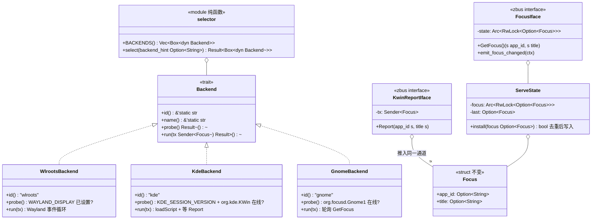
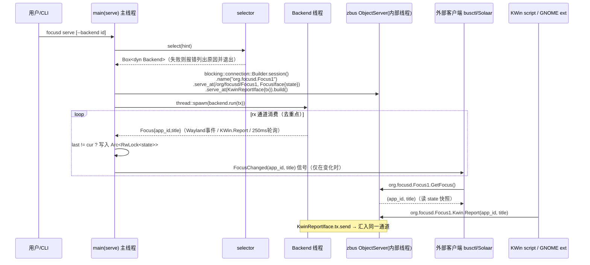

# focusd 增量架构设计与任务分解（迭代二）

> 架构师：高见远 ｜ 日期：2026-09-08
> 输入：`docs/PRD-increment.md`（PM 许清楚）+ 主理人 5 项裁定 + 现有 MVP 代码
> 基线：README 所述 MVP（wlroots 后端 + `probe`/`watch` + Backend trait + headless Sway 集成测试）

---

## ⚠️ 对 PRD 的两点修正标注（架构师判断，需主理人知悉）

### 修正 1：KDE 后端「拉模型 + 轮询」在 KWin 侧不可行，改为「KWin 推送 → focusd 去重」

主理人裁定 KDE 用「拉模型 + 轮询 250ms，KWin script 暴露 D-Bus 接口返回活动窗口」。**经核实该方案的前半句在 KWin 上不可行**：

- KWin Scripting API 只有 `callDBus(service, path, interface, method, args)` 这一种**单向对外**调用能力（自 KDE 4.9 至 Plasma 6 均如此）；
- KWin 脚本**无法注册 bus name、无法导出可被外部调用的 D-Bus 方法**、也没有定时器 API。业界参照 kdotool（jinliu/tvidal-net）的实现，全部是「脚本对 `workspace.windowActivated` 等信号作出反应，用 `callDBus` 把结果推回客户端自己的 D-Bus 地址」。

**替代设计（本架构采纳）**：
- KWin 脚本订阅 `workspace.windowActivated`（+ 活动窗口 `captionChanged`），`callDBus` **推送**到 focusd 自己注册的 `org.focusd.Focus1` 服务上的 `org.focusd.Focus1.Kwin.Report(app_id, title)` 方法；
- focusd 侧进入**同一条 channel → 同一个去重循环**，语义与「focusd 侧去重后 emit」的裁定完全一致；
- 「250ms 轮询 + 拉模型」完整落在 **GNOME 后端**上——GNOME Shell 扩展运行在 GJS 中，可以用 `Gio.DBus.session.own_name()` 注册自己的 bus name 并导出 `GetFocus()` 方法，天然支持 focusd 主动轮询（间隔 `FOCUSD_POLL_MS`，默认 250ms，可配置）。

净效果：两个后端都满足 PRD 的功能验收（watch/GetFocus/FocusChanged 正确工作），差异只在 KDE 链路是推送而非轮询，**且推送语义下信号实时性更好、CPU 开销更低**。

### 修正 2：zbus 版本定为 5.x，blocking API 确认可用

`zbus::blocking` 模块（4.x 起稳定，5.x 为当前主版本）提供 `blocking::Connection`、`blocking::connection::Builder`、`blocking::Proxy`、`SignalContext` 等，**内部自带 executor 线程，无需引入 tokio**。Cargo.toml 中旧注释 `zbus = "4" / tokio` 作废。

---

## Part A：系统设计

### 1. 实现方案

#### 1.1 核心技术挑战

| 挑战 | 应对 |
|---|---|
| D-Bus 服务与阻塞式后端事件循环共存，不引 tokio | zbus 5 blocking API（自带内部线程）+ std::thread + mpsc，与现有同步模型零冲突 |
| 三种后端事件模型差异大（Wayland 推送 / KWin 推送 / GNOME 轮询） | 统一收敛到「后端线程 → `mpsc::Sender<Focus>` → serve 主循环」，Backend trait 不改 `run()` 签名 |
| 去重逻辑只该存在一份 | 去重从 wlroots 私有逻辑提升为 serve/watch 共用的主循环职责；后端允许继续内部去重（优化），但**信号与 GetFocus 的正确性由主循环保证** |
| KDE/GNOME 无法在 CI 跑真桌面 | 契约 mock：CI 中用 zbus 自起 mock 服务（模拟 KWin Report 调用方 / GNOME 扩展服务），验证 Rust 侧客户端逻辑；真桌面行为进 `docs/MANUAL-TEST.md` 人工清单 |
| 无显示 CI 中验证 serve + D-Bus | headless Sway + `dbus-run-session`（CI 已有）内跑 `focusd serve`，用 `busctl --user call` 断言 `GetFocus()`、`busctl --user monitor` 断言 `FocusChanged` |

#### 1.2 架构模式

保持现有「**后端适配器 + 通道**」模式，新增「**状态中心 + D-Bus 门面**」：

```
                    ┌────────────────────────────────────────────┐
 Wayland 事件 ──► WlrootsBackend.run(tx)                        │
 KWin callDBus ─► KdeBackend.run(tx)  ──► mpsc::channel ──► serve/watch 主循环
 250ms 轮询 ────► GnomeBackend.run(tx)                        │
                    └────────────────────────────────────────────┘
                                                    │ 去重后
                                        ┌───────────┴───────────┐
                                        │ Arc<RwLock<Option<Focus>>> │
                                        └───────────┬───────────┘
                                          zbus blocking ObjectServer
                                          org.focusd.Focus1 @ /org/focusd/Focus1
                                          GetFocus() / FocusChanged 信号 / Kwin.Report
```

- **Backend trait 演进**（最小改动）：新增 `id()`（机器可读标识，供 `--backend` 与探测顺序用）与 `probe()`（轻量探测，`Err` 携带人可读原因）；`name()`、`run()` 不动。
- **选择器** `selector.rs`：纯函数式、环境可注入，顺序 `wlroots → kde → gnome`；`--backend` 强校验失败时列出全部后端 id 与各自探测失败原因。
- **D-Bus 模块**：一个 zbus blocking connection 同时承担 server（GetFocus/Kwin.Report）与 signal 发射；`watch` 子命令完全不走 D-Bus，输出格式不变（裁定 2）。

### 2. 文件列表

#### 新增文件

| 相对路径 | 职责 |
|---|---|
| `src/backend/selector.rs` | 后端注册表、`select()`/`select_by_id()` 探测与选择逻辑；含环境注入单测 |
| `src/backend/kde.rs` | KDE 后端：probe（`KDE_SESSION_VERSION` + bus 上存在 `org.kde.KWin`）、run（loadScript → 等 Report 推入 channel）；脚本文件由 `include_str!` 内嵌、运行时落盘 `$XDG_DATA_HOME/focusd/kwin/main.js` |
| `src/backend/gnome.rs` | GNOME 后端：probe（bus 上存在 `org.focusd.Gnome1`，否则提示安装扩展）、run（按 `FOCUSD_POLL_MS` 轮询扩展 `GetFocus()` 推入 channel） |
| `src/dbus/mod.rs` | zbus blocking 服务：`FocusIface`（GetFocus/FocusChanged）、`KwinReportIface`（Report 方法）；`start_serve()` 组装 connection + 状态 |
| `tests/kde_kwin_report.rs` | 契约 mock 测试：zbus 起测试连接，模拟 KWin `callDBus` 调 `Report`，断言进入 channel 且去重正确 |
| `tests/gnome_poll.rs` | 契约 mock 测试：起 mock `org.focusd.Gnome1` 服务返回序列化焦点序列，断言轮询/去重行为 |
| `packaging/kde/org.focusd.kwin/metadata.json` | KWin Script 包元数据（支持 `kpackagetool6 --type=KWin/Script` 安装路径） |
| `packaging/kde/org.focusd.kwin/contents/code/main.js` | KWin 脚本：`windowActivated`/`captionChanged` → `callDBus` 推送 resourceClass + caption |
| `packaging/gnome/focusd@rayc2026.github.io/metadata.json` | GNOME Shell 扩展元数据 |
| `packaging/gnome/focusd@rayc2026.github.io/extension.js` | 扩展：own_name `org.focusd.Gnome1`，导出 `GetFocus()` 返回 WM_CLASS + title |
| `packaging/systemd/focusd.service` | systemd user unit，依赖 `graphical-session.target`，`ExecStart=focusd serve` |
| `docs/dbus.md` | D-Bus 接口文档（XML 签名、busctl/gdbus 用例、未来迁移 `io.github.rayc2026.focusd` 说明） |
| `docs/MANUAL-TEST.md` | KDE/GNOME 真机人工验证清单 |

#### 修改文件

| 相对路径 | 修改点 |
|---|---|
| `Cargo.toml` | 加 `zbus = "5"`（blocking，默认 feature，无 tokio）；删除旧注释 |
| `.github/workflows/ci.yml` | ① 去 `continue-on-error: true`（**第一批，先于一切功能代码**）；② integration job 增加 serve + busctl/gdbus 断言段；③ build job 增装 `dbus` 相关包（zbus 纯 Rust 无系统依赖，仅需 `dbus-run-session` 已装） |
| `src/main.rs` | clap 改三子命令 `probe`/`watch`/`serve`，均加 `--backend <id>`；`serve` 接线 dbus 模块；`watch` 行为不变；`probe` 升级为列出所有后端探测结果 |
| `src/backend/mod.rs` | Backend trait 加 `id()`/`probe()`；新增 `dedup` 辅助（供 serve/watch 主循环共用）；声明 `pub mod selector/kde/gnome` |
| `src/backend/wlroots.rs` | 实现 `id()`/`probe()`；协议版本 `3..=3` 处加 TODO 注释（裁定 4） |
| `README.md` | 架构指南（如何加后端）、后端选择机制、D-Bus 概览（链接 docs/dbus.md）、KDE/GNOME 安装指引、测试策略说明 |

### 3. 数据结构与接口

#### 3.1 Rust 核心类型（类图见 §3.4 / `docs/class-diagram.mermaid`）



要点：

- **`Focus` 两字段不变**（确认项）：D-Bus 签名 `(s app_id, s title)` 与之一一对应；`None` 映射为空串 `""`（D-Bus 无 null 字符串，文档说明）。
- `probe()` 返回 `Result<()>`，`Err` 文案是**面向用户可操作**的（「请安装扩展：gnome-extensions install ...」）。
- `KwinReportIface::Report` 不直接写状态，而是 `tx.send(Focus{..})` —— 与 Wayland/轮询路径汇入**同一条 channel**，去重集中在主循环。

#### 3.2 D-Bus 契约（接口定义，zbus 宏实现，文档用 XML 表达）

```xml
<node>
  <interface name="org.focusd.Focus1">
    <!-- 当前焦点快照；无焦点时两个字段均为空串 -->
    <method name="GetFocus">
      <arg name="app_id" type="s" direction="out"/>
      <arg name="title"  type="s" direction="out"/>
    </method>
    <!-- 仅在焦点真正变化（去重后）时发射 -->
    <signal name="FocusChanged">
      <arg name="app_id" type="s"/>
      <arg name="title"  type="s"/>
    </signal>
  </interface>
  <interface name="org.focusd.Focus1.Kwin">
    <!-- KWin 脚本 callDBus 推送入口；对 focusd 是 server 方法 -->
    <method name="Report">
      <arg name="app_id" type="s" direction="in"/>
      <arg name="title"  type="s" direction="in"/>
    </method>
  </interface>
</node>
```

- Bus name：`org.focusd.Focus1`（裁定 1），对象路径 `/org/focusd/Focus1`。
- GNOME 扩展侧契约（focusd 作为 client）：`org.focusd.Gnome1` @ `/org/focusd/Gnome`，方法 `GetFocus() -> (s wm_class, s title)`。

#### 3.3 Backend trait 最终形态

```rust
pub trait Backend {
    /// 机器可读标识，取值 "wlroots" | "kde" | "gnome"
    fn id(&self) -> &'static str;
    /// 人可读名称（保持现有文案）
    fn name(&self) -> &'static str;
    /// 轻量探测；Err 信息面向用户可操作
    fn probe(&self) -> anyhow::Result<()>;
    /// 阻塞事件循环，签名不变
    fn run(&self, tx: std::sync::mpsc::Sender<Focus>) -> anyhow::Result<()>;
}
```

### 4. 程序调用流程（serve 模式时序图，另存 `docs/sequence-diagram.mermaid`）



关键性质：

- zbus blocking `Connection::build()` 自起内部线程处理 ObjectServer，主线程继续 `rx.recv()` 循环，无锁竞争点（state 仅主线程写、ObjectServer 线程读，`RwLock` 粒度极小）。
- 信号发射在主线程用 `SignalContext::new(&conn, path, iface)` + `emit`，天然保证「先更新状态、后发信号」的顺序。
- 无 compositor / 无会话 bus 时：`serve` 启动失败以明确错误退出（PRD 验收：不挂死）。

### 5. KDE / GNOME 后端组件设计

#### 5.1 KDE：KWin Script（`packaging/kde/org.focusd.kwin/contents/code/main.js`）

```js
// focusd KWin script：把活动窗口推给 focusd 的 D-Bus 服务
const SERVICE = "org.focusd.Focus1";
const PATH    = "/org/focusd/Focus1";
const IFACE   = "org.focusd.Focus1.Kwin";

function report(w) {
    if (w) callDBus(SERVICE, PATH, IFACE, "Report",
                    w.resourceClass || "", w.caption || "");
}

// 1) 启动即报告当前活动窗口（补齐初始状态）
report(workspace.activeWindow);
// 2) 激活切换
workspace.windowActivated.connect(report);
// 3) 活动窗口标题变化（Plasma 6：window 对象信号）
workspace.windowAdded.connect(function (w) {
    if (w && w.captionChanged) {
        w.captionChanged.connect(function () {
            if (workspace.activeWindow === w) report(w);
        });
    }
});
```

- **安装双路径**：① focusd `kde` 后端启动时自动 loadScript（`org.kde.kwin.Scripting.loadScript` → `Script.run`），零用户操作，KWin 重启后需 focusd 重启（serve 常驻则无感）；② 可选 `kpackagetool6 --type=KWin/Script -i` 持久安装（README 指引）。
- **失败提示**：loadScript/`run` 调用失败时，`probe`/`run` 报错文案给出「在 KWin 脚本控制台手动加载 / kpackagetool6 安装」的可操作指引（PRD 验收要求）。
- `app_id` 来源 `resourceClass`（等价 wlroots 语义），`title` 来自 `caption`。

#### 5.2 GNOME：Shell Extension（`packaging/gnome/focusd@rayc2026.github.io/extension.js`）

```js
import Gio from 'gi://Gio';
const IFACE_XML = `
<node>
  <interface name="org.focusd.Gnome1">
    <method name="GetFocus">
      <arg type="s" direction="out" name="wm_class"/>
      <arg type="s" direction="out" name="title"/>
    </method>
  </interface>
</node>`;

export default class FocusdExtension {
    enable() {
        this._iface = Gio.DBusExportedObject.wrapJSObject(IFACE_XML, this);
        this._owner = Gio.DBus.session.own_name('org.focusd.Gnome1',
            Gio.BusNameOwnerFlags.NONE, null, null);
        this._iface.export(Gio.DBus.session, '/org/focusd/Gnome');
        // track focus via shell WM: global.display.focus_window
    }
    GetFocus() {
        const w = global.display.focus_window;
        return w ? [w.get_wm_class() ?? '', w.get_title() ?? ''] : ['', ''];
    }
    disable() { /* unexport + unown_name */ }
}
```

- Rust 侧 `GnomeBackend::run`：`zbus::blocking::Proxy` 调 `GetFocus()`，间隔 `FOCUSD_POLL_MS`（默认 250）轮询，推入 channel；去重由主循环保证。
- probe：`name_has_owner("org.focusd.Gnome1")` 为假时报错并给出安装指引（复制扩展目录到 `~/.local/share/gnome-shell/extensions/` + `gnome-extensions enable`）。
- **语义差异文档化**：GNOME 返回的是 WM_CLASS，非严格 Wayland app_id——写入 README 与 docs/dbus.md。

### 6. 测试设计

| 层 | 方式 | 位置 |
|---|---|---|
| 选择器 | 单测：注入假环境变量（`WAYLAND_DISPLAY`/`KDE_SESSION_VERSION` 等）+ mock bus 探测，覆盖「wlroots 会话选中 wlroots」「--backend 不存在报错列出可用项」「全不可用报错聚合原因」 | `selector.rs` `#[cfg(test)]` |
| D-Bus serve（wlroots 链路） | **CI 集成断言**（headless Sway + `dbus-run-session` 内）：起两个 dummy-window → `focusd serve --backend wlroots` → `busctl --user call ... GetFocus` 断言含 `focusd.win*` → `swaymsg focus right` 后 `busctl --user monitor` 断言收到 `FocusChanged` | `ci.yml` integration job 扩展段 |
| KDE Rust 客户端契约 | 契约 mock：测试内用 zbus 起临时连接调 `Kwin.Report`，断言事件进 channel 且重复值被去重；KWin 脚本加载失败路径单测（模拟 `org.kde.KWin` 不在） | `tests/kde_kwin_report.rs` |
| GNOME 轮询契约 | 契约 mock：测试内起 mock `org.focusd.Gnome1` 服务按脚本返回焦点序列，断言轮询输出与去重 | `tests/gnome_poll.rs` |
| KWin JS / 扩展 JS | **不可 CI**（无 KWin/GNOME Shell）→ `docs/MANUAL-TEST.md` 真机清单 | 人工 |

原则（PRD §4）：每个后端在 CI 中至少有契约 mock 测试；真桌面验证明确标注为人工步骤。

### 7. Anything UNCLEAR（假设声明）

1. KWin `captionChanged` 信号在 Plasma 6 各小版本签名略有差异，脚本按「存在即连接」防御式写法；真机验证项进 MANUAL-TEST。
2. `serve` 与 KWin `loadScript` 的 KWin 会话重启恢复不做自动重试（记已知限制）。
3. GNOME 扩展的 `enable/disable` 生命周期假设扩展随 shell 重载自动恢复；不做版本兼容矩阵（metadata.json 标注 shell-version 45+）。
4. 假设 CI runner 的 `dbus-run-session` 已由现有 integration job 安装（dbus-x11 包内含），serve 断言段复用同一会话。

---

## Part B：任务分解

### 8. 依赖包（Cargo.toml 增量）

```
- zbus@5: D-Bus（blocking API：zbus::blocking，默认 feature，不引 tokio）
```
无其他新增依赖（clap/log/anyhow/wayland-* 均已在位；serde 不引入，JSON 转义沿用现有手写函数）。

### 9. 任务列表（有序，含依赖与验收标准）

| 任务 | 内容（文件） | 依赖 | 验收标准 |
|---|---|---|---|
| **T01 集成 gate 转正 + 接口地基** | `.github/workflows/ci.yml`（**去 continue-on-error**）；`Cargo.toml`（加 zbus 5）；`src/backend/mod.rs`（trait 加 `id()/probe()` + dedup 辅助 + 声明子模块）；`src/backend/selector.rs`（注册表+选择逻辑+单测）；`src/backend/wlroots.rs`（实现 id/probe，协议版本 3..=3 处加 TODO 注释）；`src/backend/kde.rs`/`src/backend/gnome.rs`（占位 stub：probe 返回「尚未实现」保证可编译）；`src/main.rs`（`--backend` 参数先行接入 probe/watch） | 无 | 推送后 CI 三 job **全绿且 integration 为硬性 gate**（改 CI 后先单独推一次验证）；`cargo clippy -D warnings` 零告警；selector 单测覆盖三种会话场景 |
| **T02 D-Bus serve 模式** | `src/dbus/mod.rs`（FocusIface/KwinReportIface/启动组装）；`src/main.rs`（`serve` 子命令 + RwLock 状态 + 主循环去重）；`src/backend/mod.rs`（dedup 辅助定稿）；`ci.yml`（integration job 增加 serve + `busctl call GetFocus` / `busctl monitor FocusChanged` 断言段） | T01 | headless Sway 下 CI：`GetFocus()` 返回 dummy-window 的 app_id；切窗后 monitor 捕获 `FocusChanged`；无 compositor 时 serve 明确报错退出 |
| **T03 KDE KWin 后端** | `src/backend/kde.rs` 完整实现（probe + loadScript + 失败指引）；`packaging/kde/org.focusd.kwin/contents/code/main.js` + `metadata.json`；`tests/kde_kwin_report.rs`（契约 mock） | T02 | CI：Kwin.Report 契约测试绿（事件入 channel、去重生效）；probe 在非 KDE 环境给出可操作错误；MANUAL-TEST 中登记真机项 |
| **T04 GNOME Shell 扩展后端** | `src/backend/gnome.rs` 完整实现（probe + `FOCUSD_POLL_MS` 轮询）；`packaging/gnome/focusd@rayc2026.github.io/extension.js` + `metadata.json`；`tests/gnome_poll.rs`（契约 mock） | T01 | CI：mock 扩展服务下轮询契约测试绿；probe 无扩展时报安装指引；MANUAL-TEST 登记真机项 |
| **T05 systemd + 文档收口** | `packaging/systemd/focusd.service`；`docs/dbus.md`；`docs/MANUAL-TEST.md`；`README.md`（架构扩展指南/后端选择/D-Bus 概览/KDE+GNOME 安装指引/测试策略）；`src/main.rs`（probe 输出全后端探测结果） | T03, T04 | unit 文件含 `graphical-session.target` 依赖说明；dbus.md 签名与实现一致；外部开发者可按 README 说出「新增一个后端需要实现什么」；CI 全绿 |

**预计批次**：4 个提交批次 —— ①T01（gate 锁定）→ ②T02（D-Bus 核心）→ ③T03+T04（可并行）→ ④T05（收口）。

### 10. 共享知识（跨文件约定）

- **错误处理**：全部 `anyhow`，`.context()` 文案必须「用户可操作」（指明缺什么、怎么装）；`serve` 启动失败 `exit(1)` 不重试不挂死。
- **日志**：`log` crate + `RUST_LOG`（CI 步骤统一 `RUST_LOG=debug`）；serve 模式日志走 stderr（journald 友好），stdout 仅用于 CLI 人类输出；关键路径（后端选中、D-Bus name 获取、loadScript 结果）用 `info!`，通道/去重细节 `debug!`。
- **并发模型**：后端线程 → `mpsc::Sender<Focus>`；serve 主线程独占写 `Arc<RwLock<Option<Focus>>>`；所有后端推送汇入同一 channel，去重只在主循环一处。
- **D-Bus 约定**：bus name `org.focusd.Focus1`、路径 `/org/focusd/Focus1`、`None` 字段序列化为 `""`；接口签名任何变更必须同步 `docs/dbus.md`。
- **测试约定**：CI 无法跑真桌面的部分用「zbus 起临时 mock 服务」做契约测试；每个真机验证项必须登记 `docs/MANUAL-TEST.md`，不得假装被 CI 覆盖。
- **代码注释**：沿用现状——中文注释，解释「为什么」而非「做了什么」。
