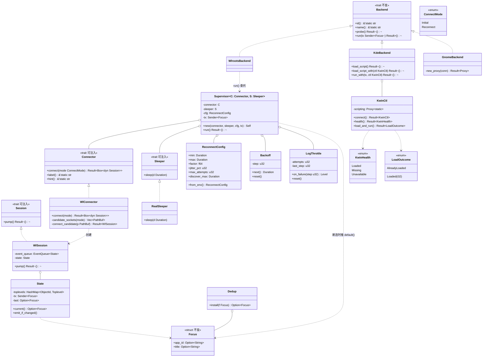
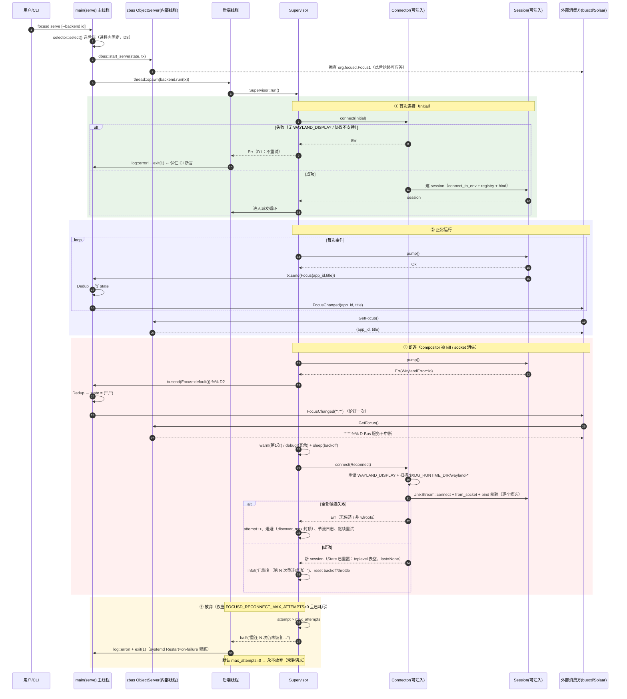
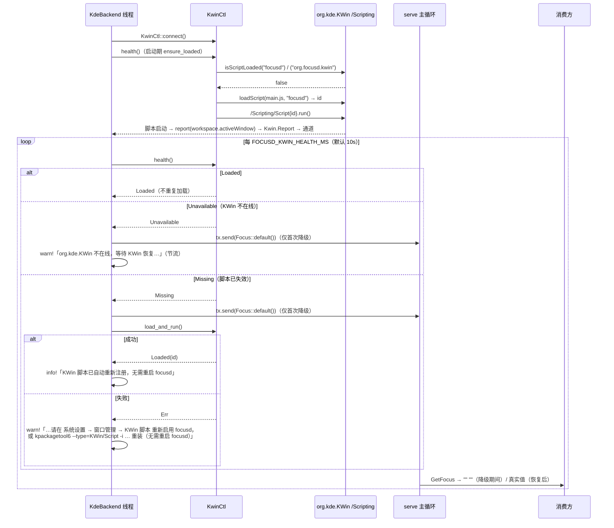
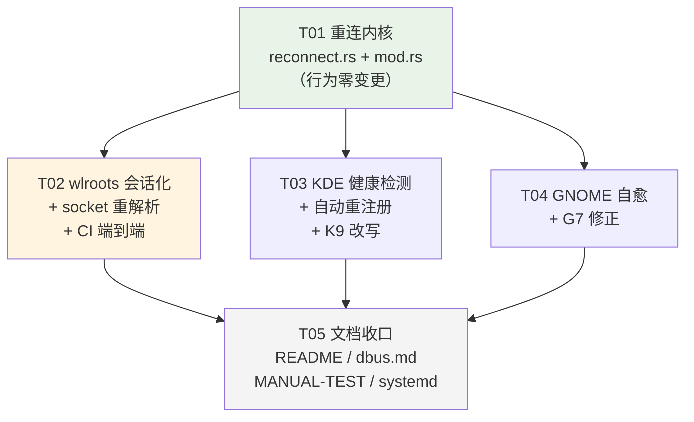

# focusd 增量架构设计与任务分解（迭代三 · 常驻韧性）

> 架构师：高见远 ｜ 日期：2026-09-14
> 输入：`docs/PRD-iter3.md`（PM 许清楚）+ 主理人 5 条裁定 + 基线代码（v0.2.0）
> 基线：`docs/ARCHITECTURE-increment.md`（迭代二）、`docs/dbus.md`、`docs/MANUAL-TEST.md`、`.github/workflows/ci.yml`
> 本文件是**增量文档**：只描述相对 v0.2.0 的变更；未提及的部分一律保持现状。

---

## 0. 结论摘要（先看这里）

| # | 裁定项 | 架构结论 |
|---|---|---|
| 1 | 重连机制形态 | 新增**会话（Session）+ 连接工厂（Connector）+ 监督器（Supervisor）**三层，落在 `src/backend/reconnect.rs`（通用）与 `src/backend/wlroots.rs`（实现）。`Backend::run()` 签名**不变**，只是内部改由 `Supervisor` 驱动；`serve`/`watch` 共用同一套（Q6：共用）。 |
| 2 | **Q4 KWin 自动重注册** | **可行，实现自动重注册。** 已核实 `org.kde.KWin /Scripting`（`org.kde.kwin.Scripting`）提供 `isScriptLoaded(s)->b`、`loadScript(s,s)->i`、`unloadScript(s)->b`、`start()`；且 KWin 源码中 `loadScript` 只在 `isScriptLoaded(pluginName)` 为真时返回 `-1`。因此「健康检测 = `isScriptLoaded`，失效则 `loadScript` + `run`」在**不重启 focusd** 的前提下成立。降级路径（KWin 不在线 / 连续重载失败）保留：对外上报无焦点 + 明确提示。 |
| 3 | **Q5 重连时 socket 重解析** | 必须重解析。实测路径限制：`wayland-client 0.31` **只有** `connect_to_env()` 与 `from_socket(UnixStream)`，**没有** `connect_to(name)`。故方案为「首次连接走 `connect_to_env()`（完全保持现状）」+「重连时自解析候选并 `UnixStream::connect` + `Connection::from_socket`」。候选顺序：`WAYLAND_DISPLAY` 重读 → `$XDG_RUNTIME_DIR/wayland-*` 按 mtime 倒序扫描 → 逐个用 `registry_queue_init` + `bind(3..=3)` 校验。取舍见 §3.5。 |
| 4 | D-Bus 契约 | **零变更**（D5）。新增文档小节说明「断连期间 GetFocus 返回空串并发射一次 `FocusChanged("","")`」，属既有「空串 = 无焦点」语义的延伸，不改签名、不加字段。 |
| 5 | 任务规模 | **5 个任务 / 4 个提交批次**。见 Part B。 |
| 6 | 依赖包 | **零新增、零删除**。`libc`（已在位）用于 `getuid()` 兜底 runtime dir；随机数用手写 LCG，不引 `rand`。 |

---

## Part A：系统设计

### 1. 实现方案

#### 1.1 核心技术挑战

| 挑战 | 应对 |
|---|---|
| 重连逻辑内联在 `run()` 里就没法单测（PRD R3 硬性要求） | 抽出 `Session`（一次连接的事件泵）/ `Connector`（连接工厂）/ `Sleeper`（退避时钟）三个可注入 trait 到 `src/backend/reconnect.rs`，`Supervisor` 只依赖 trait；测试注入脚本化假实现，可在毫秒内跑完「断连 → N 次重连失败 → 恢复」完整状态机 |
| 断连检测点在哪 | wlroots：`event_queue.blocking_dispatch()` 返回 `Err(WaylandError::Io/Protocol)` 即断连（compositor 死 → socket EOF）。KDE/GNOME：主动健康检测（KWin `isScriptLoaded` / 轮询失败计数），见 §1.3 |
| compositor 重启后 socket 改名（`wayland-1` → `wayland-2`） | 重连时重解析候选 socket（Q5，见 §3.5）；`SIGKILL` 会留下残留 socket 文件，新 compositor 必然换号——这正是 CI 要造的场景 |
| 退避会拖慢恢复（上限 30s 与「≤30s 内恢复」撞车） | 区分两类失败：**「无候选 socket」**属于极廉价的探测（1 次 readdir + 若干 connect），用较短的 `FOCUSD_RECONNECT_DISCOVER_MAX_MS`（默认 2s）封顶；**其他失败**走正常指数退避到 30s 上限。既满足恢复时限，又不给 journald 添压 |
| 注销/会话结束前后会无限重连刷爆 journald | `LogThrottle` 实现 D4：第 1 次 `warn!`、退避档位提升时 `warn!`、每 10 次 `warn!`、其余 `debug!`；恢复 `info!` |
| 三个后端失效模型完全不同 | wlroots 走**通用 Supervisor**（连接断开型）；KDE 走**健康检测循环**（脚本失效型）；GNOME 走**轮询失败计数 + Proxy 重建**（端点消失型）。三者共用 `LogThrottle` 与「失效即推 `Focus::default()`」语义，但**不强行抽象成一个 trait**——强行统一会引入比它解决的更多的复杂度 |
| 首次连接失败必须仍明确报错退出（D1） | `Supervisor::run()` 的**首次 `connect(Initial)` 失败直接 `Err` 上抛**，不进退避循环；`main.rs` 现有 `log::error! + exit(1)` 逻辑不动 → CI 那条断言自动保住 |
| CI 无法跑真 KDE/GNOME 桌面 | 沿用契约 mock 范式：新增 `tests/kde_kwin_health.rs`（mock `org.kde.KWin /Scripting`）、`tests/gnome_selfheal.rs`（mock 扩展消失→重现）；真机行为进 `MANUAL-TEST.md` |

#### 1.2 架构模式（增量）

保持现有「后端适配器 + 通道 + 主循环去重」，新增一层**监督器（Supervisor）**：

```
                  ┌─────────────────────────────────────────────────────────┐
 Wayland 事件 ──► │ WlrootsBackend::run(tx)                                 │
                  │   └─ Supervisor{ RealWlConnector, RealSleeper, Cfg }    │
                  │        ├─ connect(Initial) ── 失败 → Err（D1 报错退出）  │
                  │        ├─ session.pump()   ── Err → 推 Focus::default() │
                  │        │                        + 退避 + 重连（含扫描） │
                  │        └─ 恢复 → info!「已恢复，第 N 次重连」           │
 KWin callDBus ─► │ (KwinReportIface) ──┐                                   │
 KWin 健康循环 ──►│ KdeBackend::run(tx) │                                   │
 250ms 轮询 ────► │ GnomeBackend::run(tx)┘                                  │
                  └──────────────────────────┬──────────────────────────────┘
                                             ▼  mpsc::Sender<Focus>
                              serve / watch 主循环（Dedup → state → 信号）
```

关键性质：

- **`Backend` trait 零改动**（`id/name/probe/run` 签名与语义全部保持）。重连是后端**内部**实现细节，上层无感。
- **重连不重新选择后端**（D3）：后端实例在 `selector::select()` 时已固定，Supervisor 只重连**同一个** Connector。
- **D-Bus 服务在重连期间不中断**（R1 ⑤）：zbus `Connection` 由 serve 主线程持有，ObjectServer 在内部线程应答；后端线程的重连循环与它完全解耦。

#### 1.3 三个后端的失效模型与自愈策略

| 后端 | 失效信号 | 自愈动作 | 失效期间对外状态 |
|---|---|---|---|
| **wlroots** | `blocking_dispatch()` 返回 `Err` | 退避后 `connect(Reconnect)`（重解析 socket + 重建 registry/manager + 重置 toplevel 表） | 推 `Focus::default()` |
| **kde** | 每 `FOCUSD_KWIN_HEALTH_MS`（默认 10s）调 `isScriptLoaded`；`false` = 脚本已失效，`Err` = KWin 不在线 | 脚本失效 → `loadScript` + `run` 重注册；KWin 不在线 → 等待其回归（不重试加载） | 首次判定失效即推 `Focus::default()` |
| **gnome** | `GetFocus()` 调用失败计数 | 连续失败达 `FOCUSD_GNOME_FAIL_AFTER`（默认 3）→ 丢弃旧 Proxy 重建；每周期继续轮询 | 首次失败即推 `Focus::default()` |

三者的共同契约（写进共享知识）：**只要后端无法确认焦点，就立即向通道推 `Focus::default()`**；主循环 `Dedup` 保证对外只生效一次（`FocusChanged("","")` 恰好一次）。

#### 1.4 为什么不做的两件事（明确排除）

- **不引入 `notify`/inotify 监听 `$XDG_RUNTIME_DIR`**：退避到 2s/30s 的探测已经足够，且常驻进程不该为了「少睡几次」去背一个文件监听子系统（还会在容器/runner 上引入 fd 与权限差异）。
- **不对外暴露连接状态**（R6 / `GetStatus`）：按主理人裁定本迭代不做，降级 P2 记录到 `docs/dbus.md` 的 backlog。排障暂时只能看 journald——这是已知代价。

---

### 2. 文件清单

#### 2.1 新增

| 相对路径 | 职责 |
|---|---|
| `src/backend/reconnect.rs` | **重连内核**：`Session` / `Connector` / `Sleeper` 三个可注入 trait；`ReconnectConfig`（env 解析 + 默认 + clamp）；`Backoff`（指数退避 + 抖动 + 双上限）；`LogThrottle`（D4 日志分级抑制）；`Supervisor`（连接/派发/断连/重连/恢复/放弃 状态机）；`#[cfg(test)]` 内的 `FakeConnector` / `FakeSession` / `FakeSleeper` 与全部重连单测 |
| `tests/kde_kwin_health.rs` | **契约 mock**：起 mock `org.kde.KWin`（`/Scripting` + `/Scripting/Script7`），验证「脚本消失 → 被 `isScriptLoaded` 感知 → 自动 `loadScript`+`run`」「重载失败 → 推无焦点 + warn 含可操作提示」「已加载 → 不重复加载」 |
| `tests/gnome_selfheal.rs` | **契约 mock**：起 mock `org.focusd.Gnome1` → 释放（模拟扩展 disable）→ 断言通道收到 `Focus::default()` → 重新起 mock（模拟 enable）→ 断言恢复推送且日志 `info` |

#### 2.2 修改

| 相对路径 | 修改点 |
|---|---|
| `src/backend/mod.rs` | `pub mod reconnect;` + 顶层 re-export（`Supervisor` / `ReconnectConfig` / `Sleeper` 等，供 main 与测试引用）；其余不动 |
| `src/backend/wlroots.rs` | ① 抽出 `WlConnector`（实现 `Connector`）：`candidate_sockets()`、`UnixStream::connect` + `Connection::from_socket`、`registry_queue_init` + `bind` 校验；② 抽出 `WlSession`（实现 `Session`，持有 `EventQueue<State>` + `State`）；③ `run()` 改为构造 `Supervisor` 并 `run()`；④ `State` 增加 `reset`（重连时清空 toplevel 表与 `last`）；⑤ `#[cfg(test)]` 增补 socket 候选解析单测 |
| `src/backend/kde.rs` | ① 新增 `KwinCtl`（持有 `blocking::Proxy<'static>` → `org.kde.KWin /Scripting`）+ `KwinHealth` / `LoadOutcome`；② `load_script` 改为基于 `isScriptLoaded` 的幂等加载，**修正 `-1` 语义**（`-1` = 已加载，不是失败）；③ `run()` 把 `loop { thread::park() }` 替换为健康检测循环（R4）；④ 保留 `pub fn load_script()` 公开入口与**既有错误文案**（现有单测依赖它） |
| `src/backend/gnome.rs` | `run()` 增：失败计数 → 首次失败推 `Focus::default()` → 达阈值重建 Proxy → `LogThrottle` 分级 warn（含 `gnome-extensions enable` 提示）→ 恢复 `info`；把建 Proxy 抽成 `fn new_proxy(&Connection)` |
| `src/main.rs` | 极小改动：`cmd_watch`/`cmd_serve` 的「后端退出」文案补充「（重连已放弃 / 首次连接失败）」语义；启动日志打印一次生效的重连参数（`info!`，便于真机排障）。**不改线程模型、不改退出码** |
| `.github/workflows/ci.yml` | integration job **新增一个 step**：kill + 重启 headless Sway 的 L1/L2 分层断言（见 §5.3）。**现有 5 条断言一行都不许删** |
| `docs/MANUAL-TEST.md` | 修正 **G7**（见 §2.3）、改写 **K9**、新增 W/S 段真机项（kill+restart compositor、锁屏→解锁、KWin 重载、GNOME 扩展重载） |
| `docs/dbus.md` | 新增「连接中断期间的语义」小节（**不改签名**）；末尾登记 R6 `GetStatus` 为 P2 backlog |
| `README.md` | 「已知限制」第 2/3 条按实现结果改写；KDE 段落去掉「KWin 重启后需重启 focusd」；新增「重连与自愈」小节 + `FOCUSD_*` 环境变量表 |
| `packaging/systemd/focusd.service` | 仅加注释：说明 `Restart=on-failure` 是**兜底**而非掩盖，重连失败必须有 ERROR 日志（R8 ②） |

#### 2.3 ⚠️ 文档与实现一致性核查（主理人约束 #2）

> 教训：文档撒谎比 bug 更误导真机验证者。逐条对照当前 `src/backend/gnome.rs` 与 `docs/MANUAL-TEST.md` G7。

| G7 现有描述 | 代码现状 | 判定 |
|---|---|---|
| 「serve 不崩溃」 | ✅ 成立：轮询失败只 `continue` | 相符 |
| 「日志出现轮询失败 debug」 | ❌ **不相符**：`log::debug!` 在 `RUST_LOG` 未设时被 `env_logger` 默认级别（`error`）过滤。真机按 G7 原样执行 `./focusd serve --backend gnome` **看不到任何日志**（`info!` 的「D-Bus 服务就绪」同样不可见）。systemd unit 里设了 `RUST_LOG=info`，连 `info` 都看不到 `debug` | **需修正**：G7 必须写明 `RUST_LOG=debug` |
| 「重新 enable 后恢复」 | ⚠️ **不被代码保证**：`proxy` 在 `run()` 里只创建一次，代码里**没有任何重建/重试逻辑**，恢复与否完全依赖 zbus Proxy 每次按 well-known name 重新解析（大概率成立但非契约）；且**恢复时没有任何日志**，验证者无法区分「恢复了」与「一直没恢复」 | **需修正**：改为「代码显式重建 Proxy + 恢复时 `info!` 日志」，并新增断言 |
| （缺失）失败期间 `GetFocus()` 返回什么 | ❌ **最危险的缺失**：当前失败期间**不推任何快照**，`GetFocus()` 返回**陈旧值**。这正是 R5/R2 要根治的「静默陈旧」，文档却只字未提 | **需补**：失败期间 `GetFocus` 必须返回 `ss "" ""` |

**修正动作**（落到 T04 验收标准）：

1. G7 步骤补 `RUST_LOG=debug`；
2. G7 预期改为：disable 后 `GetFocus` → `ss "" ""` 且总线上出现一次 `FocusChanged("","")`；`journal`/stderr 出现含 `gnome-extensions enable focusd@rayc2026.github.io` 的 `WARN`；
3. G7 预期补：重新 enable 后**无需重启 focusd**，≤1 个轮询周期恢复上报且出现 `INFO` 恢复日志；
4. K9 同步改写（见 §2.2）。

---

### 3. 数据结构与接口

#### 3.1 类图（另见 `docs/ARCHITECTURE-iter3.md` 内嵌，本文件即为该图）



#### 3.2 重连内核（`src/backend/reconnect.rs`）

```rust
/// 一次「会话」＝一条已建立的连接 + 它的事件泵。
/// 只暴露一个动作：阻塞等下一批事件。Err 即「会话已断，请重连」。
pub trait Session: Send {
    fn pump(&mut self) -> anyhow::Result<()>;
}

/// 连接工厂（**可测试性的注入点**）。
pub trait Connector: Send + Sync {
    fn connect(&self, mode: ConnectMode) -> anyhow::Result<Box<dyn Session>>;
    /// 后端名，用于日志（如 "wlroots 后端"）
    fn label(&self) -> &'static str;
    /// 失效时给用户的可操作提示（写进 warn 文案尾部）
    fn hint(&self) -> &'static str { "" }
}

#[derive(Clone, Copy, PartialEq, Eq, Debug)]
pub enum ConnectMode {
    /// 进程启动后的首次连接：只走 WAYLAND_DISPLAY，失败即报错退出（D1）
    Initial,
    /// 运行中断连后的重连：允许重解析 + 扫描候选（Q5）
    Reconnect,
}

/// 退避时钟（可注入，测试用假时钟零等待）
pub trait Sleeper: Send + Sync {
    fn sleep(&self, d: Duration);
}
pub struct RealSleeper;

#[derive(Debug, Clone, Copy, PartialEq)]
pub struct ReconnectConfig {
    pub min: Duration,           // FOCUSD_RECONNECT_MIN_MS          默认 500ms   clamp 10..=60_000
    pub max: Duration,           // FOCUSD_RECONNECT_MAX_MS          默认 30_000  clamp >= min
    pub factor: f64,             // FOCUSD_RECONNECT_FACTOR          默认 2.0     clamp 1.0..=10.0
    pub jitter_pct: u32,         // FOCUSD_RECONNECT_JITTER_PCT      默认 20      clamp 0..=50（0 = 关闭，测试/确定性用）
    pub max_attempts: u32,       // FOCUSD_RECONNECT_MAX_ATTEMPTS    默认 0 = 无限
    pub discover_max: Duration,  // FOCUSD_RECONNECT_DISCOVER_MAX_MS 默认 2_000   clamp 100..=30_000
}
impl ReconnectConfig { pub fn from_env() -> Self { /* 逐个解析 + clamp + max>=min 修正 */ } }

/// 指数退避：min * factor^step，封顶 max；若最近一次失败是「无候选 socket」则再封顶 discover_max。
pub struct Backoff { cfg: ReconnectConfig, step: u32 }
impl Backoff {
    pub fn next(&mut self, discover_only: bool) -> Duration;  // 内含 ±jitter_pct% 抖动
    pub fn reset(&mut self);
    pub fn step(&self) -> u32;
}

/// D4 日志分级抑制：第 1 次 warn；退避档位提升 warn；每 10 次 warn；其余 debug。
pub struct LogThrottle { attempts: u32, last_step: u32, last_warn: u32 }
impl LogThrottle {
    pub fn on_failure(&mut self, step: u32) -> log::Level;
    pub fn reset(&mut self);
}

pub struct Supervisor<C: Connector, S: Sleeper> { /* connector / sleeper / cfg / tx */ }
impl<C: Connector, S: Sleeper> Supervisor<C, S> {
    pub fn new(connector: C, sleeper: S, cfg: ReconnectConfig, tx: Sender<Focus>) -> Self;
    /// 阻塞运行。首次连接失败直接返回 Err（D1）；达 max_attempts 亦返回 Err。
    pub fn run(self) -> anyhow::Result<()>;
}
```

`Supervisor::run()` 精确语义（工程师照此实现）：

```
session = connector.connect(Initial)?            // ← 失败：Err 上抛，run() 结束（保持现状）
loop:
    match session.pump():
      Ok(())  => continue                        // 正常派发
      Err(e)  => 进入断连处理                     // ↓

断连处理:
    tx.send(Focus::default())                    // D2：立刻对外上报「无焦点」（Dedup 保证只生效一次）
    attempt += 1
    if cfg.max_attempts > 0 && attempt > cfg.max_attempts:
        bail!("{label} 重连 {n} 次仍未恢复，放弃（最后错误: {e}）。{hint}")
    delay = backoff.next(discover_only = 失败原因是「无候选 socket」)
    match log_throttle.on_failure(backoff.step()):
        Warn  => warn!("{label} 连接断开（第 {attempt} 次重试，{e}）；{delay:?} 后重试。{hint}")
        _     => debug!(同上内容)
    sleeper.sleep(delay)
    loop:                                        // 重连重试
        match connector.connect(Reconnect):
            Ok(s)  => { session = s
                        info!("{label} 已恢复（第 {attempt} 次重连成功）")
                        backoff.reset(); throttle.reset(); attempt = 0; generation += 1
                        break }
            Err(ce)=> { attempt += 1
                        if 达上限: bail!(...)
                        按同一节流规则打日志
                        sleeper.sleep(backoff.next(...)) }
```

#### 3.3 wlroots 会话与 socket 重解析（Q5 结论）

```rust
pub struct RealWlConnector;
pub struct WlSession { event_queue: EventQueue<State>, state: State }

impl Connector for RealWlConnector {
    fn connect(&self, mode: ConnectMode) -> Result<Box<dyn Session>> {
        match mode {
            // 首次：完全保持现状（connect_to_env 语义），零回归风险
            ConnectMode::Initial => {
                let conn = Connection::connect_to_env().context(
                    "无法连接 Wayland display。请确认 WAYLAND_DISPLAY 已设置且在 Wayland 会话中")?;
                self.init(conn)
            }
            // 重连：重解析候选，逐个用「建 registry + bind manager」校验
            ConnectMode::Reconnect => {
                let mut last = None;
                for p in candidate_sockets() {
                    let stream = match UnixStream::connect(&p) { Ok(s) => s, Err(e) => { last = Some(e); continue } };
                    let conn = match Connection::from_socket(stream) { Ok(c) => c, Err(e) => { last = Some(e); continue } };
                    match self.init(conn) { Ok(s) => return Ok(s), Err(e) => last = Some(e) }
                }
                Err(anyhow!("重连失败：已尝试全部候选 socket（{}）均无可用 \
                             zwlr_foreign_toplevel_manager_v1；最后错误: {}", 候选列表, last))
            }
        }
    }
}

/// 候选顺序：
///   1) 重读 WAYLAND_DISPLAY（绝对路径直接用；相对名拼到 $XDG_RUNTIME_DIR 下）
///   2) scan $XDG_RUNTIME_DIR 下 wayland-*，按 mtime 倒序（新 compositor 的 socket 更新）
///   3) 去重（1 优先）
/// XDG_RUNTIME_DIR 缺失时兜底 /run/user/<uid>（libc::getuid，libc 已在依赖里）
pub fn candidate_sockets() -> Vec<PathBuf>;
```

**取舍说明（写进注释）**：

- 为何**不**用 inotify 监听目录：常驻进程不值得为此背一个监听子系统；2s 级探测已够（且 CPU 可忽略）。
- 为何首次连接**不扫描**：保持与 v0.2.0 逐字节一致的行为，避免「扫到 WSLg 的 Weston / 另一个 wlroots 实例」把首次连接的错误文案搞乱。扫描只在「已经连上过、现在断了」时启用。
- 扫描的**误连风险**：若 runtime dir 下有多个 wlroots 系 socket（WSLg + 嵌套 Sway），扫描可能连到「另一个」compositor。缓解：env 候选永远排第一；bind 校验会剔除非 wlroots 的；真机多 compositor 场景登记进 `MANUAL-TEST.md`。

#### 3.4 KDE 健康检测与自动重注册（Q4 结论）

```rust
pub const PLUGIN_NAME: &str   = "focusd";             // 自动 loadScript 用的 pluginName
pub const PKG_PLUGIN_ID: &str = "org.focusd.kwin";    // kpackagetool6 安装路径的 KPlugin.Id
pub const HEALTH_MS_DEFAULT: u64 = 10_000;            // FOCUSD_KWIN_HEALTH_MS, clamp 1_000..=300_000

pub struct KwinCtl { scripting: blocking::Proxy<'static> }  // → org.kde.KWin /Scripting

pub enum KwinHealth { Loaded, Missing, Unavailable }
pub enum LoadOutcome { AlreadyLoaded, Loaded(i32) }

impl KwinCtl {
    pub fn connect() -> Result<Self>;                       // 只在 run() 开头调一次
    /// 双名检测：PLUGIN_NAME 或 PKG_PLUGIN_ID 任一已加载即 Loaded；
    /// 调用本身失败（ServiceUnknown）→ Ok(Unavailable)；其他 Err 原样上抛。
    pub fn health(&self) -> Result<KwinHealth>;
    /// isScriptLoaded? → AlreadyLoaded : loadScript(path, PLUGIN_NAME) + Script{id}.run()
    ///   id == -1  → AlreadyLoaded（KWin 源码：-1 只在 isScriptLoaded 为真时返回）
    ///   id <  -1  → Err("KWin loadScript 返回 {id}")
    pub fn load_and_run(&self) -> Result<LoadOutcome>;
}
```

已核实的 D-Bus 事实（`org.kde.KWin` @ `/Scripting`，接口 `org.kde.kwin.Scripting`，Plasma 5/6 均有）：

| 方法 | 签名 | 用途 |
|---|---|---|
| `isScriptLoaded` | `(s pluginName) -> b` | **健康检测**（本迭代核心） |
| `loadScript` | `(s filePath, s pluginName) -> i`（亦有单参重载） | 重注册 |
| `unloadScript` | `(s pluginName) -> b` | 备用（本迭代不主动调） |
| `start` | `() -> ()` | 备用（等价于逐个 `Script.run`） |
| `org.kde.kwin.Script.run` @ `/Scripting/Script{id}` | `() -> ()` | 启动脚本（沿用现状） |

**结论：自动重注册可行，且不需要重启 focusd。** 脚本被重新 `run()` 后会重新执行 `main.js` 全文——包括开头那句 `report(workspace.activeWindow)`，因此重连后**立即**补推当前焦点，无需等用户切窗。

顺带修掉一个既有缺陷：现代码把 `loadScript` 返回的 `-1` 当作「脚本加载失败」并 `bail!`。按 KWin 源码，`-1` 的唯一含义是「该 pluginName 已加载」——即用户已用 `kpackagetool6` 安装并启用时会误报失败。本迭代改为 `AlreadyLoaded`。

#### 3.5 GNOME 自愈

```rust
const FAIL_AFTER_DEFAULT: u32 = 3;   // FOCUSD_GNOME_FAIL_AFTER, clamp 1..=20

fn run(&self, tx) -> Result<()> {
    let conn = blocking::Connection::session()?;      // 首次失败 → Err（D1）
    let mut proxy = new_proxy(&conn)?;                // 抽成函数，便于重建
    let poll = poll_interval();
    let after = fail_after();
    let mut fails = 0u32;
    let mut throttle = LogThrottle::default();
    loop {
        match proxy.call::<_, _, (String, String)>("GetFocus", &()) {
            Ok((c, t)) => {
                if fails > 0 {
                    log::info!("GNOME 扩展已恢复（连续失败 {fails} 次后自动重建 Proxy 并恢复上报）");
                    fails = 0; throttle.reset();
                }
                let _ = tx.send(Focus { app_id: empty_to_none(&c), title: empty_to_none(&t) });
            }
            Err(e) => {
                fails += 1;
                let _ = tx.send(Focus::default());   // D2：失效即对外「无焦点」（Dedup 去重）
                match throttle.on_failure(0) {
                    Level::Warn => log::warn!(
                        "Shell 扩展轮询失败（第 {fails} 次）: {e}；对外上报无焦点。\
                         请确认扩展已启用：gnome-extensions enable focusd@rayc2026.github.io"),
                    _ => log::debug!("Shell 扩展轮询失败（第 {fails} 次）: {e}"),
                }
                if fails % after == 0 {
                    match new_proxy(&conn) { Ok(p) => proxy = p, Err(pe) => log::debug!("Proxy 重建失败: {pe}") }
                }
            }
        }
        std::thread::sleep(poll);
    }
}
```

**取舍（写进注释）**：只重建 **Proxy**、不重建 **Connection**。zbus `Connection` 是与 dbus-daemon 的长连接，Shell 重载不影响它；而每 750ms 重建一次连接会持续泄漏 zbus 的内部 executor 线程——对常驻进程是不可接受的。

#### 3.6 D-Bus 契约：**零变更**

- `org.focusd.Focus1.GetFocus() -> (s app_id, s title)` —— 不变
- `org.focusd.Focus1.FocusChanged(s, s)` —— 不变
- `org.focusd.Focus1.Kwin.Report(s, s)` —— 不变
- `Focus` 结构 —— 不加字段（D5）

仅在 `docs/dbus.md` 增补**语义说明**（不是签名变更）：

> **连接中断期间的语义**：当 focusd 无法确认焦点（compositor 断开、KWin 脚本失效、GNOME 扩展消失）时，`GetFocus()` 返回 `ss "" ""`，并发射**一次** `FocusChanged("","")`。这与「锁屏 / 桌面空白处」的既有语义完全一致，**消费方无需任何改动**；恢复后按正常逻辑再次发射真实快照。

---

### 4. 程序调用流程

#### 4.1 serve 模式连接生命周期（正常 / 断连 / 恢复 / 放弃）



#### 4.2 重连状态机

```mermaid
stateDiagram-v2
    [*] --> Initial: Supervisor::run()
    Initial --> Connected: connect(Initial) Ok
    Initial --> Failed: connect(Initial) Err（D1 报错退出）

    Connected --> Disconnected: session.pump() Err
    Connected --> Connected: pump() Ok

    Disconnected --> Backoff: 推 Focus::default()<br/>attempt++，节流日志
    Backoff --> Reconnecting: sleep(delay)
    Reconnecting --> Connected: connect(Reconnect) Ok<br/>info!「已恢复，第 N 次重连」
    Reconnecting --> Backoff: connect(Reconnect) Err<br/>attempt++，退避（discover_max 封顶）
    Backoff --> Failed: attempt > max_attempts（默认 0 = 无限，不触发）

    Connected --> [*]: 进程信号 / systemd stop
    Failed --> [*]: Err 上抛 → exit(1)
```

#### 4.3 KDE 健康检测循环



---

### 5. 测试设计

#### 5.1 CI 单测（100% 覆盖重连逻辑，`#[cfg(test)]` 在 `src/backend/reconnect.rs`）

| 用例 | 假实现 | 断言 |
|---|---|---|
| 退避序列 | `FakeSleeper` 记录每次 sleep | jitter=0 时序列为 500/1000/2000/4000/…/30000（封顶） |
| 「无候选 socket」封顶 | 失败原因标记 discover | 序列被 `discover_max` 截断 |
| 抖动开关 | `jitter_pct=20` | 每次 sleep 落在 `[d*0.8, d*1.2]`；`jitter_pct=0` 时完全确定 |
| 断连推无焦点 | `FakeSession{ [Ok, Ok, Err, ...] }` | 通道收到 `Focus::default()` |
| 重连恢复 | `FakeConnector{ 前 3 次 Err，第 4 次 Ok }` | 4 次 `connect(Reconnect)`（第 1 次是 `connect(Initial)` 成功）、恢复后继续 pump |
| 永远失败 | `FakeConnector{ 永远 Err }` + `max_attempts=5` | `run()` 返回 Err，attempt 恰为 5 |
| 首次失败不重连 | `FakeConnector{ Initial 失败 }` | `run()` 立即 Err，`connect` 只被调 1 次（D1） |
| 日志分级 | 断言 `LogThrottle::on_failure` 返回值序列 | 第 1 次 Warn；2–9 次 Debug；第 10 次 Warn；档位提升那次 Warn |
| 参数解析 | 设 env | clamp 生效、`max>=min` 修正、非法值回落默认 |

`candidate_sockets()` 单测（同文件）：用 `std::env::temp_dir()` 建临时 runtime dir，造 `wayland-1`/`wayland-2` 两个文件并调不同 mtime，断言顺序与去重。

> 全部单测**不碰真实时间和总线**，总耗时 < 1s。

#### 5.2 CI 契约 mock（`tests/`，需 `dbus-run-session`，已在位）

- `tests/kde_kwin_health.rs`：mock 起 `org.kde.KWin`（`/Scripting` + `/Scripting/Script7`）。用例：① `load_script()` 成功且 `Script.run` 被调用一次；② `isScriptLoaded=true` 时健康循环**不**再 load；③ 置 `loaded=false` → 健康循环自动 `loadScript`（`loads>=2`）；④ 置 `loaded=false` 且 `loadScript` 返回 `-2` → 通道收到 `Focus::default()`。真机有 KWin 时整文件跳过（沿用现有 `RealProbe.bus_has_owner` 守卫）。
- `tests/gnome_selfheal.rs`：mock 起 `org.focusd.Gnome1` → `drop` 释放（模拟 disable）→ 断言通道收到 `Focus::default()` → 重新起 mock → 断言恢复推送真实快照。

#### 5.3 CI 端到端（headless Sway，新增 step）

> **分层断言**（PRD §5）：L1 必过、L2 尽力；L2 不稳定时登记为 MANUAL-TEST 项，**绝不因此关 gate 或加 `continue-on-error`**。

```yaml
  - name: Reconnect assertions (kill + restart headless Sway)
    run: |
      export WLR_BACKENDS=headless
      dbus-run-session bash -s <<'EOF'
      set -e
      export RUST_LOG=debug
      export FOCUSD_RECONNECT_MIN_MS=200
      export FOCUSD_RECONNECT_MAX_MS=2000
      export FOCUSD_RECONNECT_DISCOVER_MAX_MS=500
      export FOCUSD_RECONNECT_JITTER_PCT=0

      ./target/debug/examples/dummy-window --app-id focusd.win3 --title three > /tmp/w3.log 2>&1 &
      W3=$!; sleep 3
      ./target/debug/focusd serve --backend wlroots > /tmp/serve2.log 2>&1 &
      SERVE=$!; sleep 4

      # 前置条件：正常上报
      OUT=""
      for i in $(seq 1 10); do
        OUT=$(busctl --user call org.focusd.Focus1 /org/focusd/Focus1 org.focusd.Focus1 GetFocus || true)
        echo "$OUT" | grep -q "focusd.win3" && break; sleep 1
      done
      echo "$OUT" | grep -q "focusd.win3" || { echo "FAIL: 重连测试前置条件未满足"; cat /tmp/serve2.log; exit 1; }

      # ---- L1（必过）：强杀 compositor，制造残留 socket + 改名 ----
      pkill -9 -x sway || true
      sleep 3
      kill -0 $SERVE || { echo "FAIL: compositor 被 kill 后 serve 不应退出"; cat /tmp/serve2.log; exit 1; }
      busctl --user introspect org.focusd.Focus1 /org/focusd/Focus1 >/dev/null \
        || { echo "FAIL: 重连期间 D-Bus 服务中断"; exit 1; }
      EMPTY=$(busctl --user call org.focusd.Focus1 /org/focusd/Focus1 org.focusd.Focus1 GetFocus || true)
      echo "GetFocus after kill: $EMPTY"
      echo "$EMPTY" | grep -q '"" ""' \
        || { echo "FAIL: 断连期间 GetFocus 应返回空串（返回了陈旧值？）"; cat /tmp/serve2.log; exit 1; }
      echo "VERIFIED L1: serve 存活 + D-Bus 不中断 + GetFocus 空串"

      # ---- L2（尽力）：重启 compositor，验证自动重连恢复 ----
      nohup sway > /tmp/sway2.log 2>&1 &
      for i in $(seq 1 30); do ls "$XDG_RUNTIME_DIR"/wayland-* >/dev/null 2>&1 && break; sleep 1; done
      ./target/debug/examples/dummy-window --app-id focusd.win4 --title four > /tmp/w4.log 2>&1 &
      W4=$!; sleep 3
      OK=""
      for i in $(seq 1 40); do
        OK=$(busctl --user call org.focusd.Focus1 /org/focusd/Focus1 org.focusd.Focus1 GetFocus || true)
        echo "reconnect try$i: $OK"
        echo "$OK" | grep -q "focusd.win4" && break; sleep 1
      done
      if echo "$OK" | grep -q "focusd.win4"; then
        echo "VERIFIED L2: 自动重连并恢复上报"
      else
        echo "NOT VERIFIED L2：降级为真机验证项（严禁关闭 gate / 加 continue-on-error）"
      fi
      kill $SERVE $W3 $W4 2>/dev/null || true
      echo "=== serve log ==="; cat /tmp/serve2.log
      EOF
```

说明：

- `pkill -9 -x sway` 会留下 `wayland-1` 残留文件，重启后的 Sway 被迫改用 `wayland-2` —— **这正是 Q5 要解决的 socket 改名场景**，L2 通过即证明重解析逻辑生效。
- 本 step 必须是 integration job 的**最后一步**（杀掉 sway 会影响后续步骤）。
- 该 step 放在现有「无 compositor 时 serve 明确报错退出」断言**之后**。

#### 5.4 真机（登记 `docs/MANUAL-TEST.md`）

kill+restart compositor（真 Sway/Hyprland）、`sway reload`、锁屏→解锁信号序列、KWin 重载/重启、GNOME 扩展 disable→enable、注销前日志是否被抑制。

---

## Part B：任务分解

### 6. 依赖包（Cargo.toml）

**零增删。** 沿用 `wayland-client 0.31` / `wayland-protocols-wlr 0.3` / `zbus 5` / `anyhow` / `log` / `env_logger` / `clap 4` / `libc 0.2`。
明确**不引入**：`rand`（抖动用手写 LCG，见共享知识）、`notify`（不做目录监听）、`tokio`（zbus blocking 已足够）。

### 7. 任务列表（有序，含依赖、验收标准与验证方式）

| 编号 | 内容（文件） | 依赖 | 验收标准 | 验证方式 |
|---|---|---|---|---|
| **T01 重连内核（可注入骨架 + 退避/日志抑制 + 单测）** | 新增 `src/backend/reconnect.rs`（`Session`/`Connector`/`Sleeper` trait、`ConnectMode`、`ReconnectConfig::from_env`、`Backoff`、`LogThrottle`、`Supervisor`，以及 `#[cfg(test)]` 的 `FakeConnector`/`FakeSession`/`FakeSleeper` + 全部重连单测）；改 `src/backend/mod.rs`（`pub mod reconnect;` + re-export） | 无（**本批次是地基**） | ① `cargo test` 新增单测全绿，覆盖：退避序列与封顶、discover 封顶、抖动开关、断连推 `Focus::default()`、前 N 次失败后恢复、永远失败达 `max_attempts` 返回 Err、**首次连接失败只调一次 `connect` 且直接 Err（D1）**、日志分级序列（1→Warn、2–9→Debug、10→Warn）；② 单测用 `FakeSleeper`，**总耗时 < 1s**；③ `cargo clippy --all-targets -- -D warnings` 零告警；④ **本批次不改变任何后端行为**，CI 现有 5 条断言全部保持绿 | CI 单测（`dbus-run-session cargo test`）+ clippy |
| **T02 wlroots 会话化 + socket 重解析 + CI 端到端重连断言** | 改 `src/backend/wlroots.rs`（抽 `RealWlConnector`/`WlSession`、`candidate_sockets()`、`State` 重置、`run()` 委托 `Supervisor`，补候选解析单测）；改 `src/main.rs`（启动打印生效的重连参数、`后端退出` 文案区分「首次失败」与「重连放弃」）；改 `.github/workflows/ci.yml`（新增 §5.3 的 reconnect step） | T01 | ① **L1 必过**：`pkill -9 sway` 后 serve 进程存活、`busctl introspect` 成功、`GetFocus` 返回 `"" ""`；② **L2 尽力**：重启 sway + 新 dummy-window 后 ≤40s `GetFocus` 返回真实 app_id（未过则打印 NOT VERIFIED 并降级为 MANUAL-TEST 项，**不得 exit 1、不得关 gate**）；③ **现有 5 条断言一条不删且保持绿**：watch stdout 断言、`GetFocus` 返回 `focusd.win2`、`FocusChanged` 被捕获、焦点消失返回空串、**无 compositor 时 serve 明确报错退出**；④ smoke job 的 probe 优雅退出保持；⑤ clippy 零告警 | CI 端到端（headless Sway）+ CI 单测 |
| **T03 KDE KWin 健康检测 + 自动重注册（Q4 结论落地）** | 改 `src/backend/kde.rs`（`KwinCtl`/`KwinHealth`/`LoadOutcome`、`isScriptLoaded` 双名检测、修 `-1` 语义为 `AlreadyLoaded`、把 `loop{thread::park()}` 换成健康循环、保留 `pub fn load_script()` 与既有错误文案）；新增 `tests/kde_kwin_health.rs`；改 `docs/MANUAL-TEST.md`（**K9 改写**） | T01（`LogThrottle`） | ① CI 契约 mock 全绿：`isScriptLoaded=true` 时不重复 load；置 false 后健康循环自动 `loadScript`+`run`；`loadScript` 返回 `-2` 时通道收到 `Focus::default()` 且 warn 含 `kpackagetool6` / 系统设置 指引；② **现有单测 `load_script_在无_kwin_环境报可操作错误` 保持绿**；③ MANUAL-TEST K9 由「需重启 focusd」改写为「≤10s 内自动重新注册，无需重启 focusd；失败则明确提示」；④ clippy 零告警 | CI 契约 mock + 真机清单（MANUAL-TEST） |
| **T04 GNOME 轮询自愈（R5）+ G7 文档修正** | 改 `src/backend/gnome.rs`（失败计数、首次失败推 `Focus::default()`、`FOCUSD_GNOME_FAIL_AFTER` 阈值重建 Proxy、`LogThrottle` 分级 warn 含 `gnome-extensions enable` 指引、恢复 `info`、`new_proxy()` 抽取）；新增 `tests/gnome_selfheal.rs`；改 `docs/MANUAL-TEST.md`（**G7 按 §2.3 四项修正**） | T01（`LogThrottle`） | ① CI 契约 mock 全绿：mock 消失 → 通道收到 `Focus::default()`；mock 重现 → 恢复推送真实快照；② **现有 `tests/gnome_poll.rs` 保持绿**；③ G7 修正四项全部落地（`RUST_LOG=debug`、失败期间 `ss "" ""` + 一次 `FocusChanged("","")`、warn 含 `gnome-extensions enable`、**无需重启 focusd** 且恢复有 INFO 日志）；④ clippy 零告警 | CI 契约 mock + 真机清单（MANUAL-TEST） |
| **T05 文档收口 + systemd 兜底说明 + 已知限制同步** | 改 `README.md`（已知限制第 2/3 条改写、KDE 段去掉「需重启 focusd」、新增「重连与自愈」+ `FOCUSD_*` 环境变量表）；改 `docs/MANUAL-TEST.md`（新增 W/S 段真机项：kill+restart compositor、`sway reload`、锁屏→解锁、KWin 重载、GNOME 扩展重载、注销前日志抑制）；改 `docs/dbus.md`（新增「连接中断期间的语义」+ R6 `GetStatus` 记 P2 backlog）；改 `packaging/systemd/focusd.service`（注释：`Restart=on-failure` 仅兜底，重连失败必须有 ERROR 日志） | T02、T03、T04 | ① README 已知限制与实现**逐条对得上**（第 2 条改为「KWin 重启后自动恢复，无需重启 focusd」；第 3 条改为「compositor 重启后自动重连，断连期间对外上报无焦点」）；② MANUAL-TEST 覆盖本迭代全部真机项；③ dbus.md 新增语义与代码行为一致，且**签名零变更**；④ CI 三 job 全绿 | CI（文档不改代码，仅回归）+ 人工审阅 |

**提交批次（4 批，每批一次 push = 一次 CI run）**：

```
① T01（重连内核，行为零变更，风险最低）
② T02（wlroots 重连 + CI 端到端；CI 改动最大，单独一批便于定位）
③ T03 + T04（两个后端自愈，互不耦合，可一批推）
④ T05（文档收口）
```

**任务数：5 个（符合 ≤5 上限）**；每个任务 ≥3 个文件；仅 T02 依赖 T01，T03/T04 只依赖 T01，T05 收口。

### 8. 任务依赖图



---

## 9. 共享知识（工程师必读，跨文件约定）

### 9.1 主理人两条硬性约束（不得违反）

1. **禁止删除或弱化现有两条 CI 断言**：integration job 的「无 compositor 时 `serve` 明确报错退出」、smoke job 的「无 Wayland 环境 `probe` 优雅退出」。它们守护「配置错误就该报错，不该在 systemd 里挂僵尸」这一产品决策。**任何 PR 若让这两条断言消失、被 `|| true` 吞掉、或被 `continue-on-error` 软化，一律打回。**
2. **文档不得撒谎**：`docs/MANUAL-TEST.md` 的每条预期必须与代码实际行为逐条核对；发现不一致**一并修正文档**（本轮已查实 G7 三项不符，见 §2.3，落在 T04）。同理，`README.md` 已知限制、KDE 段文案必须与实现同步。

### 9.2 重连语义（D1–D6 落地口径）

- **首次连接失败 → 明确报错退出，不重连**（`ConnectMode::Initial`）。运行中断开 → 无限重连（默认），serve/watch 共用（Q6）。
- **失效即无焦点**：任何时刻后端无法确认焦点，立刻 `tx.send(Focus::default())`；主循环 `Dedup` 保证对外只发射一次 `FocusChanged("","")`。**绝不保留最后值**。
- **重连不重新选择后端**（D3）：后端身份在进程生命周期内固定。
- **日志分级（D4）**：`LogThrottle` 统一实现——第 1 次 `warn!`、退避档位提升 `warn!`、每 10 次 `warn!`、其余 `debug!`；恢复 `info!` 且必须出现「已恢复（第 N 次重连）」字样。

### 9.3 环境变量命名规范（全部 `FOCUSD_*`，clamp 后使用）

| 变量 | 默认 | 说明 |
|---|---|---|
| `FOCUSD_RECONNECT_MIN_MS` | 500 | 初始退避 |
| `FOCUSD_RECONNECT_MAX_MS` | 30000 | 退避上限 |
| `FOCUSD_RECONNECT_FACTOR` | 2.0 | 倍率（f64） |
| `FOCUSD_RECONNECT_JITTER_PCT` | 20 | 抖动百分比，`0` = 关闭（**CI 单测必须设 0**） |
| `FOCUSD_RECONNECT_MAX_ATTEMPTS` | 0 | `0` = 无限重试 |
| `FOCUSD_RECONNECT_DISCOVER_MAX_MS` | 2000 | 「无候选 socket」时的退避封顶 |
| `FOCUSD_KWIN_HEALTH_MS` | 10000 | KWin 脚本健康检测周期 |
| `FOCUSD_GNOME_FAIL_AFTER` | 3 | GNOME 连续失败达此值重建 Proxy |
| `FOCUSD_POLL_MS` | 250 | （既有，不变）GNOME 轮询间隔 |

CI 里统一用：`FOCUSD_RECONNECT_MIN_MS=200 MAX_MS=2000 DISCOVER_MAX_MS=500 JITTER_PCT=0`。

### 9.4 编码约定

- **抖动不引 `rand`**：用手写 LCG，`seed = SystemTime::now().subsec_nanos()`；`jitter_pct=0` 时函数直接原样返回，保证测试确定性。
- **错误处理**：全 `anyhow`，`.context()` 文案必须**用户可操作**（指明缺什么、怎么装）。warn 文案模板：`<后端> <故障>（第 N 次重试，{err}）；<delay> 后重试。<可操作提示>`。
- **日志**：`log` + `RUST_LOG`。**注意 `env_logger` 默认级别是 `error`**——真机验证文档凡涉及 debug/info 日志，必须显式写 `RUST_LOG=debug`。
- **并发**：后端线程 → `mpsc::Sender<Focus>` → 主循环；serve 主线程独占写 `Arc<RwLock<Option<Focus>>>`；**去重只在主循环一处**。重连循环不得触碰 `state`，只推 `Focus::default()`。
- **clippy 是 gate**：`cargo clippy --all-targets -- -D warnings`。注意 `new_without_default`（`Supervisor::new` 参数 >1 不受影响）、`too_many_arguments`（>7 个参数要改传 `ReconnectConfig`）、`type_complexity`。
- **注释**：中文，解释「为什么」而非「做了什么」；任何 env 变量、KWin D-Bus 方法、socket 扫描顺序都要写清取舍。

### 9.5 测试约定

- 可注入优先：任何阻塞/时间/IO 相关的逻辑都要有 trait + 假的对应物（沿用 `selector::ProbeContext` 范式）。
- 假实现放 `#[cfg(test)]`，**不污染生产 API**；集成级契约测试才放 `tests/`。
- `cargo test` 由 CI 在 `dbus-run-session` 内执行；cargo 顺序执行各测试二进制，但**同一二进制内的用例并行**——同一 bus name 只允许一处 own。
- CI 里跑不了真 KDE/GNOME：契约 mock + `MANUAL-TEST.md`，**不假装覆盖**。

---

## 10. 待明确事项 / 风险登记（Anything UNCLEAR）

| # | 事项 | 影响 | 处置 |
|---|---|---|---|
| **U1** | `event_queue.blocking_dispatch()` 在 compositor 被 `SIGKILL` 后是否**一定**返回 `Err`（而非永久阻塞）？理论上 socket EOF 会让 wayland-backend 返回 `WaylandError::Io` | 高——若永久阻塞，L1 会「看起来通过」但实际从未检测 | T02 的 L1 断言会证伪。**备选方案**：改用 `conn.prepare_read()` + `poll(fd, POLLIN\|POLLHUP\|POLLERR)` 显式检测挂断（需 `libc::poll`，`libc` 已在位）。若 L1 出现「进程存活但 GetFocus 一直返回旧值」，即走备选 |
| **U2** | KWin `isScriptLoaded` 的 pluginName 与 `kpackagetool6` 安装路径的 `KPlugin.Id` 不一致（`focusd` vs `org.focusd.kwin`） | 中——单名检测会漏判 kpackagetool 安装的实例，导致重复 loadScript | 本迭代**双名检测**（任一命中即 Loaded），不改既有安装行为。后续若要统一为 `org.focusd.kwin`，属破坏性变更，单独立项 |
| **U3** | 自动重载 KWin 脚本会**覆盖用户在「系统设置 → KWin 脚本」里的显式禁用** | 低——产品上可接受（focusd 拥有该脚本的生命周期） | 写进 README 与 MANUAL-TEST：想彻底关掉请 `systemctl --user stop focusd`，而不是在系统设置里禁用 |
| **U4** | 扫描 `$XDG_RUNTIME_DIR/wayland-*` 时若存在多个 wlroots 系 compositor（WSLg Weston + 嵌套 Sway），可能连到「另一个」 | 中——局部环境行为异常 | env 候选永远优先；bind 校验剔除非 wlroots；多 compositor 场景登记 MANUAL-TEST |
| **U5** | `zbus::blocking::Proxy` 是否内部持有 `Connection` 克隆（决定 `KwinCtl` 要不要额外存 `conn` 字段） | 低——编译期即可发现 | 按「Proxy 自带连接」实现；若编译报生命周期错误，则在 `KwinCtl` 增加 `_conn` 字段（下划线前缀避免 `dead_code` 触发 `-D warnings`） |
| **U6** | GNOME 只重建 Proxy 不重建 Connection：若 session bus 自身挂了则无法自愈 | 低——session bus 由 systemd/dbus-daemon 保障，且重建连接会泄漏线程 | 已知取舍，写进代码注释；真机清单登记 |
| **U7** | R6 `GetStatus() -> (s state, u32 generation)` 本迭代不做 | 中——排障只能靠 journald，用户无法区分「真无焦点」与「focusd 正在重连」 | 按主理人裁定降级 P2，登记进 `docs/dbus.md` backlog；`generation` 计数在 `Supervisor` 内部先留字段（不对外），为将来预留 |
| **U8** | R7 协议版本协商（v1/v2，去掉硬编码 `3..=3`）本迭代不做 | 低——防御性收益 | 保持 P2；`bind(3..=3)` 处 TODO 注释保留并指向本文件 |
| **U9** | PRD R8 ①「unit 增 `Restart=on-failure`」现状**已具备**（`RestartSec=3`） | 无 | T05 只补注释（兜底而非掩盖） |
| **U10** | `docs/ARCHITECTURE-increment.md` §7 UNCLEAR 2（「KWin 重启恢复不做自动重试」）已被本迭代推翻 | 无 | 历史增量文档**不改**，本文件 §0/§3.4 即为更正记录 |

---

## 11. 附：`docs/dbus.md` 待增补文案（T05 直接用）

```markdown
## 连接中断期间的语义（迭代三）

当 focusd 无法确认焦点时（compositor 断开、KWin 脚本失效、GNOME 扩展消失），
对外行为与「锁屏 / 桌面空白处」完全一致：

- `GetFocus()` 返回 `ss "" ""`；
- 发射**一次** `FocusChanged("","")`（由主循环 Dedup 保证恰好一次）；
- 恢复后按正常逻辑再次发射真实快照。

这是既有「空串 = 无焦点」约定的延伸，**签名零变更、消费方零改动**。
消费方仍应遵守：空串 → 回落默认配置，不要把上一次的值缓存起来当当前值用。

> P2 backlog：将来可能新增只读的 `GetStatus() -> (s state, u32 generation)`
> （`state ∈ {connected, reconnecting, unavailable}`）以便排障时区分
> 「真无焦点」与「focusd 正在重连」。届时同样保持 `GetFocus`/`FocusChanged` 不变。
```
